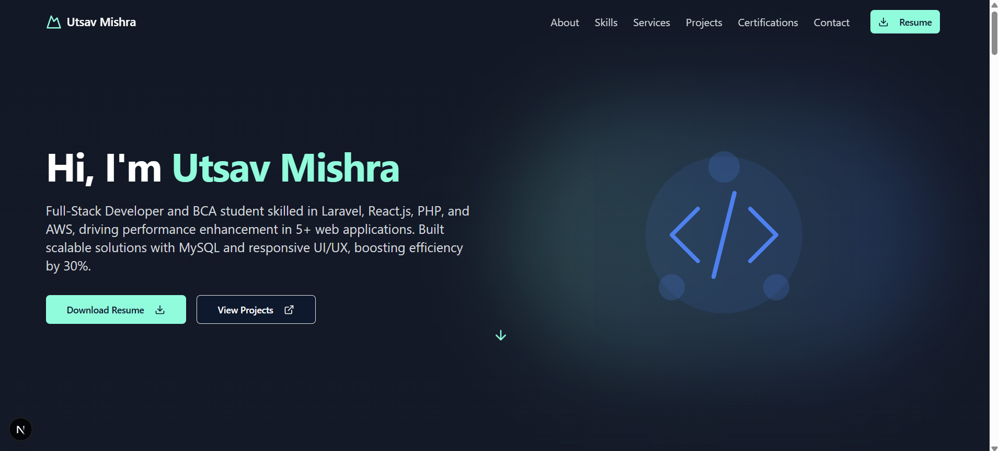
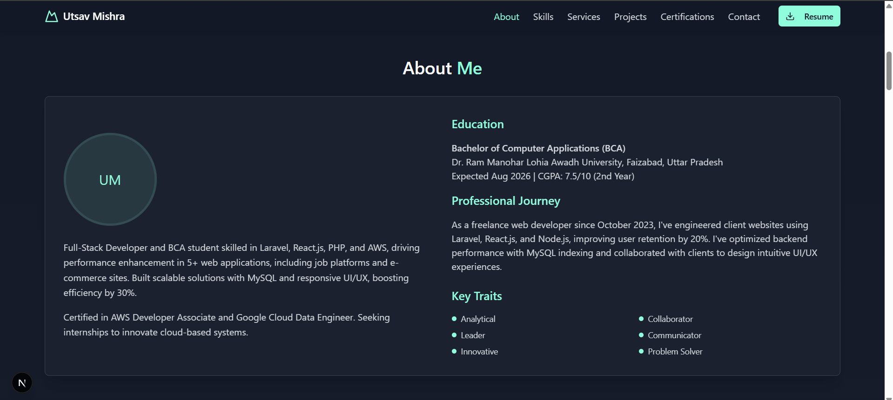
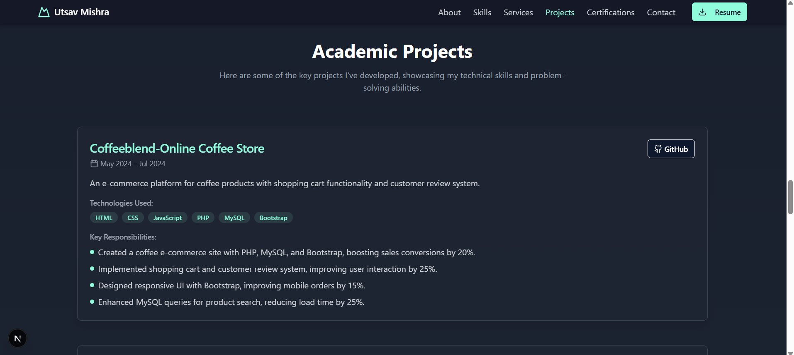
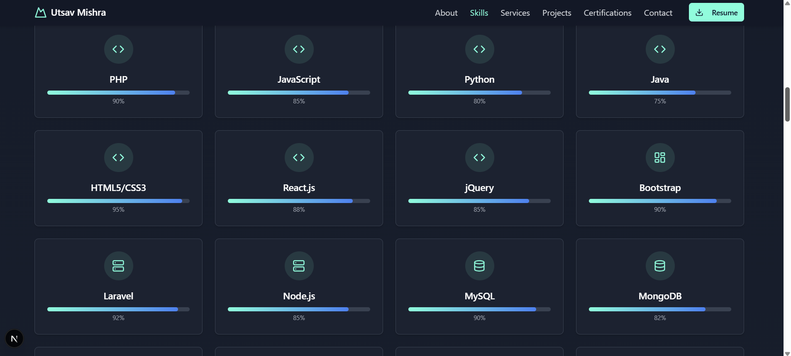

# 💼 Utsav Mishra - Developer Portfolio

Welcome to my personal portfolio website built using **React.js** and deployed on **Vercel**. This site highlights my skills, projects, and provides a way to connect with me professionally.

Live Demo 🚀: [https://portfolio-bhaktofmahakal.vercel.app](https://portfolio-bhaktofmahakal.vercel.app)

---

## 🧠 Tech Stack

    - ⚛️ **React.js** – Component-based architecture for fast and dynamic UI.
    - 🎨 **CSS / Tailwind CSS** – Clean, responsive, and modern styling.
    - 💌 **EmailJS** – Contact form integration to receive emails directly.
    - 🌐 **Vercel** – For lightning-fast deployment and global CDN hosting.

📸 Screenshots

 Home Page	                                        About Page                                       Projects Page               	                     Skills Page
                                          

📬 Contact Form Integration

The contact form uses EmailJS to send form data directly to Admin and Email.

Secure

Lightweight

Fast

🌐 Deployment
This project is live at:

👉

    https://portfolio-bhaktofmahakal.vercel.app

Deployed using Vercel, which provides global performance and fast CI/CD integration.

📈 What I Learned

    Routing with react-router-dom
    
    Responsive layouts with CSS/Flexbox
    
    Integration of external services like EmailJS
    
    Clean component structuring in React
    
    Deploying on Vercel with custom domain option

🧑‍💻 Author

Utsav Mishra

🎓 BCA Student @ Dr. RML Avadh University
🌐 LinkedIn
📫 Email:

    utsavmishraa005@gmail.com
GitHub:

     bhaktofmahakal

